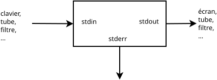
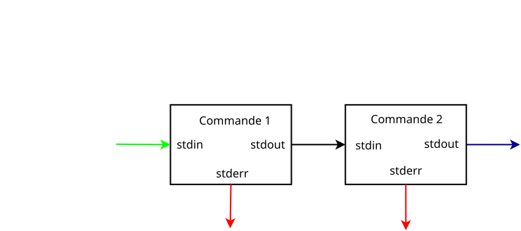

# Les redirections

Unix utilisait des télétypes à ses origines puis des écrans en mode texte.
Les première commandes étaient conçues pour fonctionner avec du texte lu 
au clavier, envoyé sur des écrans ou dans des fichiers. Le texte permettait
d'écrire facilement les fichiers de configuration de et de lire à l'écran

Le programme qui dialogue avec l'utilisateur est un shell,
il y en a de nombreuses version. Nous utiliserons principalement le bash.
Il affiche un $ à l'utilisateur et attend des commandes.

Le format texte s'est avéré très pratique par sa souplesse et sa relative facilité 
de lecture. les commandes de bases d'Unix ont été considérablement enrichies.

Ces commandes font des traitements spécialisés. Le shell permet de faire des
séquences de traitement et de rediriger les entrées et sorties des commandes
et d'enchaîner les commandes et de leur faire lires des données depuis des fichiers
et de les enregistrer dans des fichiers. C'est de la "plomberie" !

# Les entrées et sorties standard d'une commande

Habituellement les commandes commencent leur exécution avec les fichiers  suivants :

| Numéro | nom | direction | par défaut |
|--------|-----|-------|-------------------|
|      0 |stdin|Entrée|Clavier|
|      1 |stdout|Sortie|Écran|
|      2 |stderr|Sortie|Écran|

# Les changements de direction

## le tube
Le tube sert à rediriger la sortie d'un processus vers l'entrée d'un autre. 
Il est invoqué pr ce symbole | .
Il est obtenu sur les claviers français par la combinaison de touches AltGr et |. 
La syntaxe générale est la suivante :

`cmde1 | cmde2`

Les options des commandes sont à ajouter, plus de deux commandes peuvent s'enchaîner.
La syntaxe  devient

`cmde1 option  |  cmde2 options | ... | cmden optionn`

## Depuis ou vers un fichier

Les entrées et sorties des commandes peuvent être redirigées vers des fichiers.
Les fichiers sont les fichiers sur disque ou des périphériques.

### Redirection de la sortie standard

La redirection de la sortie standarde vers un fichier se fait avec le signe **>** ou **>>**.
Avec > le fichier est effacé avant l'éxécution de la commande.
Avec >> le fichier est conservé et la sortie de la commande est ajouté.

Elle sert à conserver un résultat pour usage ultérieur.

syntaxe: 

`cmde  >  fichier`

### Redirection de l'entrée standard

La redirection de l'entrée standarde depuis un fichier se fait avec le signe **<**.

Elle sert à automatiser des commandes ou traiter des fichiers de données.
Nul besoin de retaper un texte.

syntaxe: 

`cmde  <  fichier`

### Redirection de la sortie standarde d'erreur

La redirection de la sortie standarde d'erreur vers un fichier se fait avec *2>*.

La redirection de la sortie standard d'erreur vers la sortie standard se fait avec *2>&1*.

Le fichier /dev/null est toujours vide.
À la lecture il envoie une marque de fin de fichier et 
tout ce qui y est envoyé est ignoré. 
Il sert à ignorer Les données d'une sortie en les y envoyant.

Redirection de l'entrée standarde depuis la ligne de commande
C'est typiquement utilisé dans les scripts pour remplir des fichiers de configuration
La redirection de l'entrée standarde est indiqueée avec << ou <<<
Envoyer le reste de la ligne à la commande avec <<<

`cat <<< Bonjour`

affiche Bonjour sur la sortie standard
Envoyer les lignes suivantes avec << EOF

`commande << EOF`

`Bonjour`

`...`

`EOF`

Le shell envoie à la commande ce qui les lignes entre les deux EOL.
EOL peut être n'importe quel autre nom,
mais pour la lisibilité il est préférable d'utiliser EOL.

## Exemples

### Effacer un fichier ou en créer un vide 
Astuce "Rien" envoyer vers le fichier. Ainsi pour créer un fichier vide :

`> vide`

### Ajouter une ligne à un fichier
Par exemple pour Sylvie :

`echo Sylvie Le Gall  >>  personnes.txt`

### Enchaînement de commandes
Obtenir la liste triée par ordre alphabétique des départements
de Bretagne et de la région Centre et sans les numéros et la stocker dans un fichier.

`cat depts??.txt | cut -d , -f 6 | sort > listeBC.txt`

### Usage habituel de la sortie standarde d'erreur

demander à cat d'afficher un fichier absent provoque une erreur.
Essayer cette commande :

`cat     depts24.txt    deptsabsent.txt   depts53.txt > listeBC.txt`

cat affiche un message d'erreur  à l'écran et enregiste la liste dans listeBC.txt
Il met les données qu'il a pu lire dans le fichier et il alerte l'utilisateur.
L'utilisateur voit immédiatement qu'un fichier manque.
Il a néanmoins les données existantes dans le fichier listeAC.txt
Afficher la liste avec cat

`cat listeBC.txt`

### La sortie standarde et la sortie standarde d'erreur dans le même fichier

Essayer cette commande :

`cat  depts24.txt  deptsabsent.txt  depts53.txt > listeAC.txt **2>&1**`

Aucun message d'erreur n'apparaît à l'écran, les message sont dans la liste.

Afficher la liste avec cat

`cat listeBC.txt`

### Ignorer les erreurs

Il suffit de les rediriger vers /dev/null

`cat  depts24.txt  deptsabsent.txt depts53.txt > listeAC.txt 2> /dev/null`

